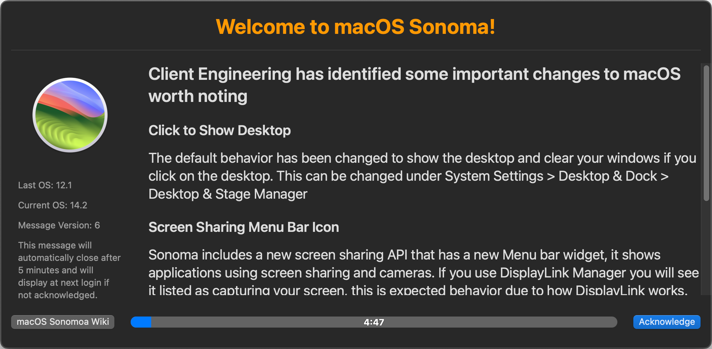

# UpgradeBuddy Sample

To run this sample, you will need:

- Outset v4
- A managed python (MacAdmins python-recommended fills this need) with the following:
  - requests
  - xattr
  - pyobjc
  - packaging
  - OPTIONAL: pyoslog
- An MDM deploying a profile
- A web server enforcing ETAG (like CloudFront!)
- MunkiPkg for packaging

## Security

See [CONTRIBUTING](CONTRIBUTING.md#security-issue-notifications) for more information.

## License

This library is licensed under the MIT-0 License. See the LICENSE file.
